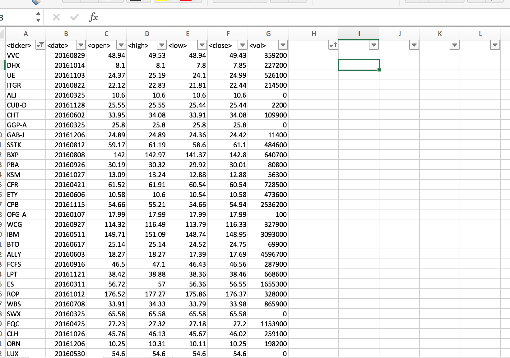
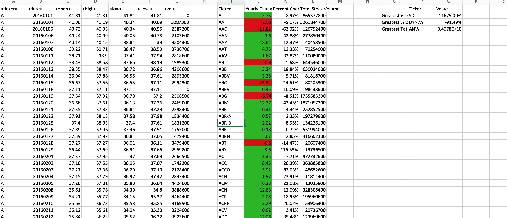

# VBA-StockData

#StockData Analysis

#Introductions

Find Clarity with in the world of chaotic stock market with this VBA script. Full Capacity analysis that let you quickly determine the following with one click of a button:

1.Stock name 
2.YealyPrice Change
3.Percentage Change
4.Total Stock Volume
5.Stock with Greatest Increase
6.Stock with Greatest Decrease
7.Stock with the Greatest Volume

From Before

To AFTER 

